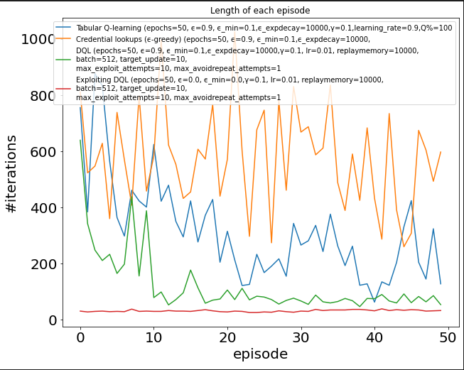
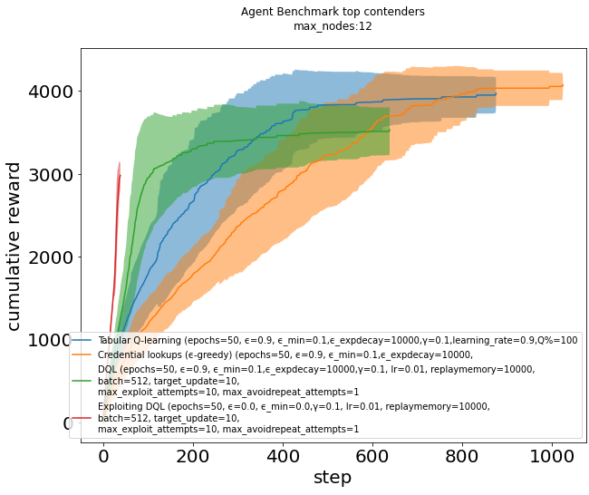
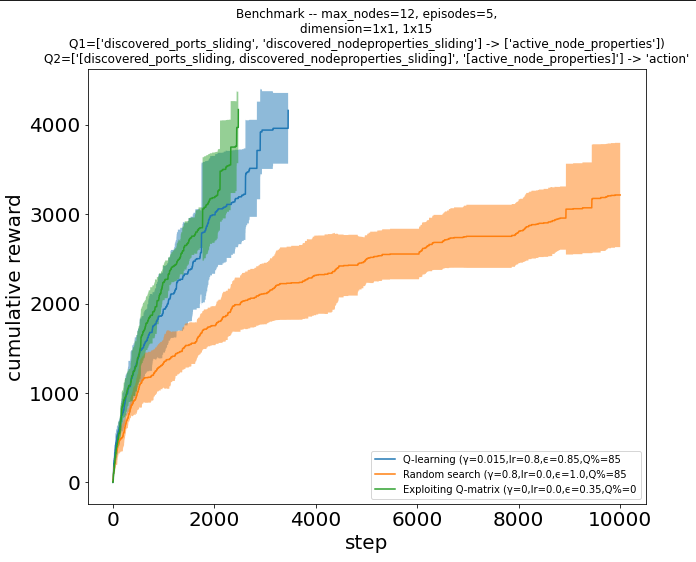
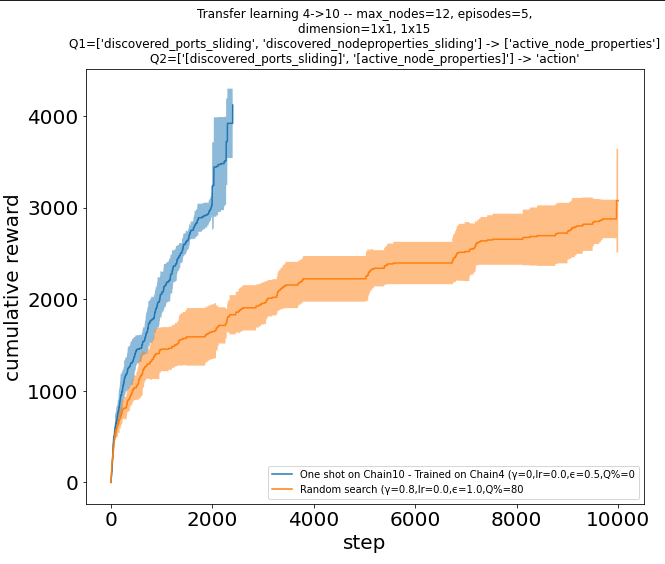
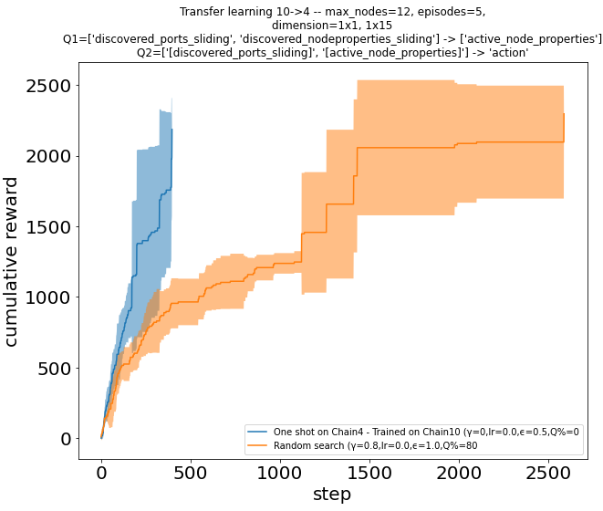

# Benchmark on baseline agent implementations

Results obtained on envrionment `CyberBattleChain10` using several algorithms: purely random search, Q-learning with epsilon-greedy, exploiting learned matrix only.

## Time to full ownership on `chain` network environment

Training plot showing duration taken to take over the entire network (Y-axis) across successive episodes (X-axis) for different attacker agent implementations (Tabular Q-learning, epsilon-greedy, Deep Q-Learning, Exploiting Q-function learnt from DQL).
Lower number of iterations is better (the game is set to terminate when the attacker owns the entire network).
Best attacker so far is the Deep Q-Learning

The next plot shows the cumulative reward function. Note that when once all the network nodes are owned there may still be additional rewards to be obtained by exploiting vulnerabilities on the owned nodes,
but on this experiment we terminate the game as soon as the agent owns all the nodes. This explains why
the DQL agent, which optimizes for network ownership, does not get to reach the maximum possible reward despite
beating all the other agents. The gym's `done` function can easily re-configured to target a specific reward instead, in which case the DQL also beats the other agents.

### Choice of features

With Q-learning, the best results were obtained when training on features that include network size-specific features, such as the number of discovered nodes (left). Good results are also obtained when using features that are not dependent on the network size (right).

| | Size agnostic features | Size-dependant features|
|--|--|--|
| Tabular Q vs Random |  |  |

## Transfer Learning on `chain` environment

This benchmark aims to measure the ability to learn a strategy from one environment and
apply it to similar envrionments of a different size. We train the agent on an environment of size $x$ and evaluate it on an environment of size $y>x$.

As expected, using features that are proportional to the size of the environment (such as the number of nodes or number of number of credentials) did not provide best results. The agent fared better instead when using temporal features like a sliding-window of ports and node properties recently discovered.

| | Train on size 4 , evaluated on size 10 | - Train on size 10, evaluated on size 4 |
|---|---|---|
Tabular Q vs Random |  |   |
