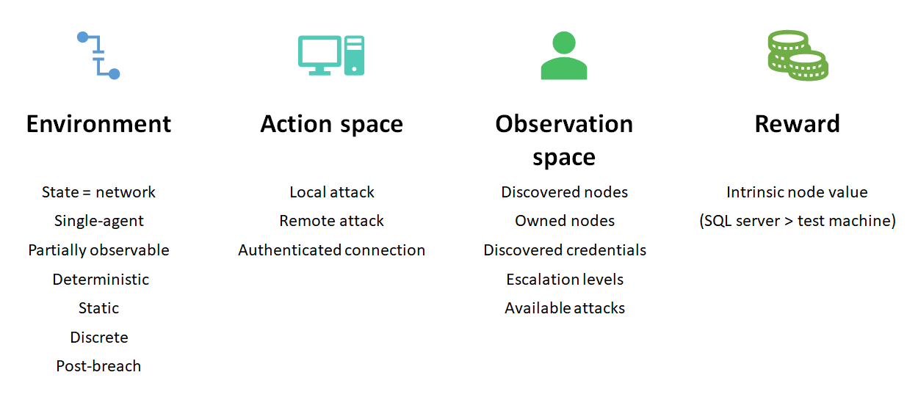
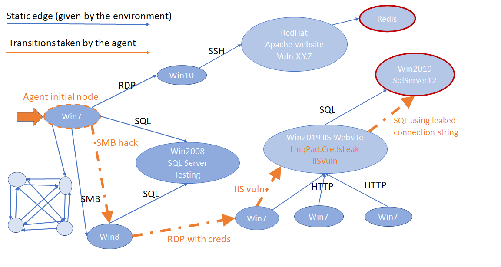
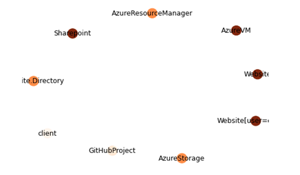
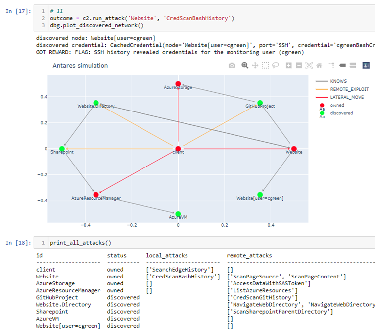
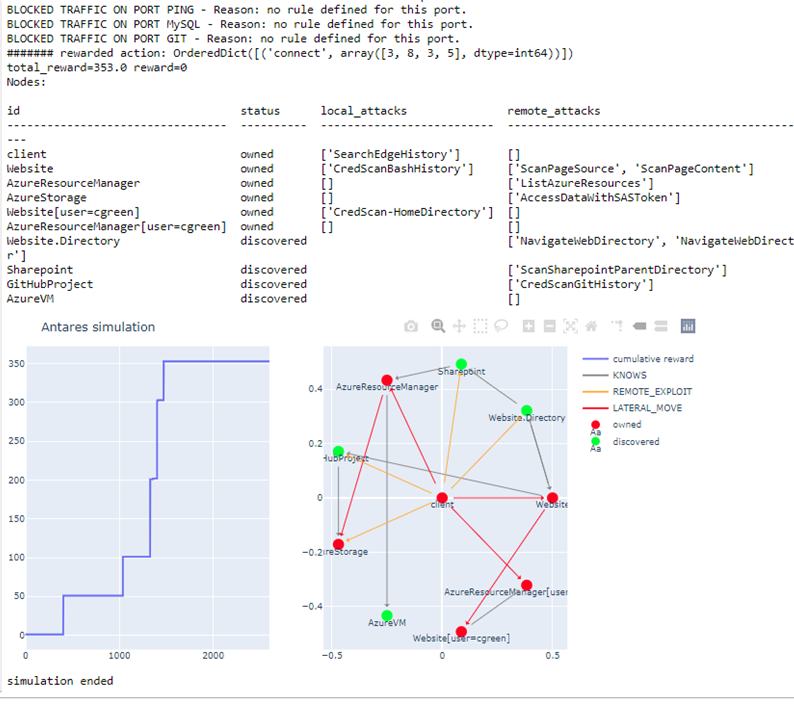

# Quick introduction to CyberBattleSim

## What is it?

A high-level parameterizable model of enterprise networks that simulates the execution of attack and defense cyber-agent.
A network topology and set of pre-defined vulnerabilities defines the arena on which the simulation is played.
The attacker evolves in the network via lateral movements by exploiting existing vulnerabilities.
The defender attempts to contain the attacker and evict it from the nework.
CyberBattleSim offers an OpenAI Gym interface to its simulation to facilitate experimentation with Reinforcement Learning algorithms.

## Why a simulation environment?

Emulation runtime environments provide high fidelity and control: you can take existing code or binaries and run them directly in virtual machines running full-fledged Operating Systems and connected over a virtualized network, while giving access to the full system state. This comes at a performance cost, however.
While simulated environments suffers from lack of realism, they tend to be Lightweight, Fast, Abstract, and more Controllable, which
makes them more amenable to experimentations with Reinforcement Learning.
Advantages of simulation include:

- Higher-level abstraction: we can modeled aspects of the system that matters to us, like application-level network communication versus packet-level network simulation. We can ignore low-level details if deemed uncessary (E.g., file system, registry).
- Flexibility: Defining new machine sensors is straightforward (e.g., does not require low-level/driver code changes); we can restrict the action space to a manageable and relevant subset.
- The global state is efficiently capturable, simplifying debugging and diagnosis.
- A lightweight runtime footprint: run in memory on single machine/process.

We may explore the use of emulation technologies in the future, in particular for benchmarking purpose, as it would provide a more  realistic assessment of the agents performances.

A design principle adopted is for the simulation to model just enough _complexity_ to represent attack techniques from the [MITRE matrix](https://attack.mitre.org/) while maintaining the _simplicity_ required to efficiently train an agent using Reinforcement Learning techniques.

On the attack-side, the current simulation focuses more particularly on the `Lateral movement` technique which are intrinsic to all post-breach attacks.

## How the simulation works

Let us go through a toy example and introduce how simulation works
using RL terminology.
Our network __environment__ is given by a directed annotated graph where
nodes represent computers and edges represent knowledge of other nodes or communication taking place between nodes.


Here you can see a toy example of network
with machines running different OSes, software.
Each machine has properties, a value, and suffers from pre-assigned vulnerabilities.
Blue edges represent traffic running between nodes and
are labelled by the communication protocol.


There is a **single agent**: the attacker.

Initially, one node is infected (post-breach assumption)

Its **goal** is to maximize reward by discovering and 'owning' nodes
in the network.

The environment is **partially observable**: the agent does not get to see all the
nodes and edges of the network graph in advance.

Instead the attacker takes actions to gradually observe the environment. There are **three kinds of actions**
offering a mix of exploitation and exploration capabilities
to the agent:
- perform a local attack,
- perform a remote attack,
- connect to other nodes.

The **reward** is a float represents the intrinsic value
of a node (e.g., a SQL server has greater value than a test machine).

The attacker breaches into the network from the Win7 node
on the left pointed by the fat orange arrow,
- then proceeds with a lateral move to the Win8 node
by exploiting a vulnerability in SMB,
- then uses some cached credential to log into a Win7 machine,
- exploits an IIS remote vulnerability to own the IIS server,
- and finally uses leaked connection strings to get to the SQL DB.


## What kind of vulnerabilities and attacks are supported by the simulation?

The simulation gym environment is parameterized by the network definition which consists of  the underlying network graph itself together with description of supported vulnerabilities and the nodes where they are present.
Since the simulation does not run any code, there is no way to actually implement vulnerabilities and exploits. Instead, we model each vulnerability abstractly by defining: a pre-condition determining if
vulnerability is active on a given node; the probability that it can be successfully exploited by an attacker; and the side-effects of a successfful exploit. Each node has a set of assigned named-properties. The pre-condition is then expressed as a boolean expression over the set of possible node properties (or flags).

### Vulnerability outcomes
Each vulnerability has a pre-defined outcome which may include:

- A leaked set of credentials;
- A leaked reference to another node in the network;
- Leaked information about a node (node properties);
- Ownerhsip to a node;
- Privilege escalation on the node.

Example of _remote_ vulnerabilities include:

- A SharePoint site exposing `ssh` credentials (but not necessarily the ID of the remote machine);
- An `ssh` vulnerability granting access to the machine;
- A github project leaking credentials in commit history;
- A SharePoint site with file containing SAS token to storage account;

Examples of _local_ vulnerabilities:

- Extracting authentication token or credentials from a system cache;
- Escalating to SYSTEM privileges;
- Escalating to Administrator privileges.

Vulnerabilities can either be defined in-placed at the node level, or can be defined globally and activated by the pre-condition boolean expression.


## Toy Example

Consider as a toy example, the 'Capture the flag' game played on the computer system depicted below:



Each graph node is a computing resource with implanted security flaws and vulnerabilities such as reused password, insecure passwords, leaked access tokens, misconfigured Access control, browsable directories, and so on.  The goal of the attacker is to take ownership of critical nodes in the graph (e.g., Azure and Sharepoint resources). For simplicity we assume that no defender is present and that the game is fully static (no external events between two action of the attacker).

We formally defined this network in Python code at [toy_ctf.py](../cyberbattle/samples/toyctf/toy_ctf.py).
Here is a snippet of the code showing how we define the node `Website` with its properties, firewall configuration and implanted vulnerabilities:

```python
nodes = {
    "Website": m.NodeInfo(
        services=[
            m.ListeningService("HTTPS"),
            m.ListeningService("SSH", allowedCredentials=[
                    "ReusedMySqlCred-web"])],
        firewall=m.FirewallConfiguration(
                    incoming=default_allow_rules,
                    outgoing=default_allow_rules
                    + [
                        m.FirewallRule("su", m.RulePermission.ALLOW),
                        m.FirewallRule("sudo", m.RulePermission.ALLOW)]),
        value=100,
        properties=["MySql", "Ubuntu", "nginx/1.10.3"],
        owned_string="FLAG: Login using insecure SSH user/password",
        vulnerabilities=dict(
            ScanPageContent=m.VulnerabilityInfo(
                description="Website page content shows a link to GitHub repo",
                type=m.VulnerabilityType.REMOTE,
                outcome=m.LeakedNodesId(["GitHubProject"]),
                reward_string="page content has a link to a Github project",
                cost=1.0
            ),
            ScanPageSource=m.VulnerabilityInfo(
                description="Website page source contains refrence to"
                            "browseable relative web directory",
                type=m.VulnerabilityType.REMOTE,
                outcome=m.LeakedNodesId(["Website.Directory"]),
                reward_string="Viewing the web page source reveals a URL to"
                              "a .txt file and directory on the website",
                cost=1.0
            ),
            ...
            )
    ),
    ...
```

### Interactive play with ToyCTF

You can play the simulation interactively using the Jupyter notebook located at [toyctf-blank.ipynb](../notebooks/toyctf-blank.ipynb). Try the following commands:

```python
env.plot_environment_graph()
plot()

c2.run_attack('client', 'SearchEdgeHistory')
plot()

c2.run_remote_attack('client', 'Website', 'ScanPageContent')
plot()

c2.run_remote_attack('client', 'Website', 'ScanPageSource')
plot()

c2.run_remote_attack('client', 'Website.Directory', 'NavigateWebDirectoryFurther')
plot()

c2.connect_and_infect('client', 'Website', 'SSH', 'ReusedMySqlCred-web')
plot()
```
The plot function displays the subset of the network explorsed so far. After a few attempts the explored network should look like this:

   

### Solution
The fully solved game is provided in the notebook [toyctf-solved.ipynb](../notebooks/toyctf-solved.ipynb).

### A random agent playing ToyCTF
The notebook [toyctf-random.ipynb](../notebooks/toyctf-random.ipynb)
runs a random agent on the ToyCTF enviornment: at each step, the agent
picks an action at random from the action space.

Here is the result after a couple of thousands iterations:

   
